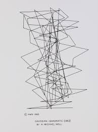
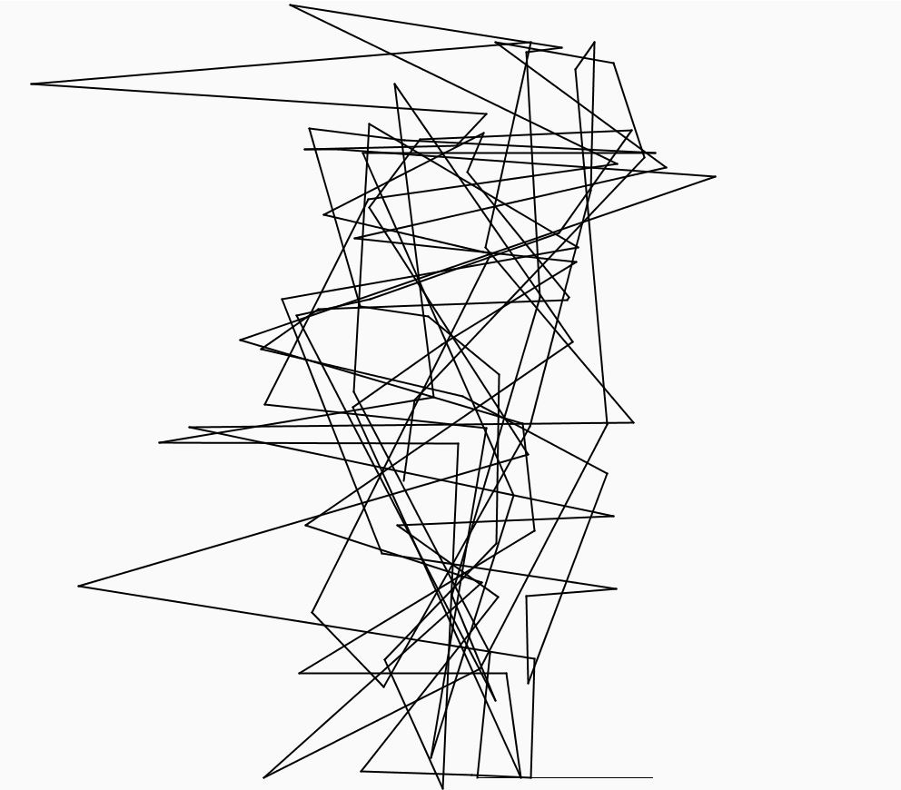
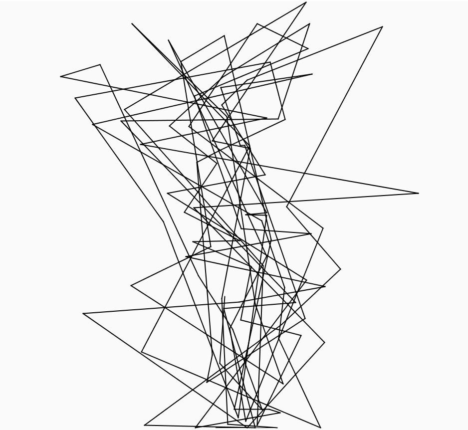

# Gaussian-Quadratic
Replica of Michael Noll's work "Gaussian-Quadratic". This piece consits on 99 lines connect 100 points whose horizontal coordinates are Gaussian. Vertical coordinates increase according to a quadratic equation. As a point reaches the top, it is reflected to the bottom to continue its rise.

See original work:

In this code similar pieces can be obtained:

  

